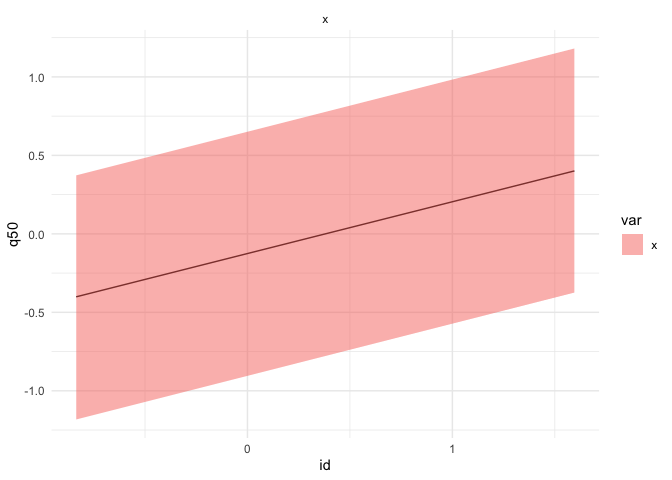
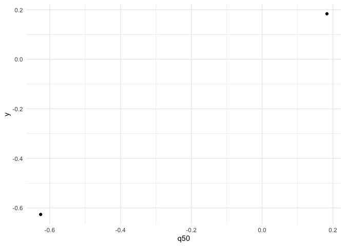

<!-- README.md is generated from README.Rmd. Please edit that file -->

# inlar

<!-- badges: start -->
<!-- badges: end -->

The goal of inlar is to ease output processing of INLA’s outputs by
putting them in `tibble` format.

## Installation

You can install the released version of inlar here.

``` r
#' remotes::install_github("kklot/inlar")
```

## Example

This is a basic example which shows you how to solve a common problem:

``` r
library(ggplot2)
library(inlar) 
set.seed(1)
```

The original data is binded to the output by default for those
subject-specific outputs.

``` r
r = INLA::inla(y ~ 1 + f(x, model = 'iid'),
  data = data.frame(y = rnorm(2), x = rnorm(2)),
  control.compute = list(config = TRUE),
  control.predictor = list(compute = TRUE, link = 1)
)

## Summary
r |> as_tibble(type = 'summary', 'random')
#>   var         id       mean        sd       q025        q50      q975
#> 1   x -0.8356286 -0.4018769 0.3894734 -1.1826484 -0.4011349 0.3727972
#> 2   x  1.5952808  0.4018712 0.3894732 -0.3737118  0.4010382 1.1815156
r |> as_tibble(type = 'summary', 'linear.predictor')
#> # A tibble: 2 x 8
#>   subj_id       mean     sd   q025    q50   q975      y      x
#>   <chr>        <dbl>  <dbl>  <dbl>  <dbl>  <dbl>  <dbl>  <dbl>
#> 1 Predictor.1 -0.624 0.0262 -0.661 -0.626 -0.573 -0.626 -0.836
#> 2 Predictor.2  0.181 0.0263  0.130  0.183  0.218  0.184  1.60

## Marginals
r |> as_tibble(type = 'marginals', 'random')
#> # A tibble: 150 x 4
#>    var      id     x          y
#>    <chr> <dbl> <dbl>      <dbl>
#>  1 x         1 -4.59 0.00000455
#>  2 x         1 -4.47 0.0000824 
#>  3 x         1 -4.46 0.0000843 
#>  4 x         1 -4.36 0.000102  
#>  5 x         1 -3.80 0.000237  
#>  6 x         1 -3.76 0.000254  
#>  7 x         1 -3.00 0.000923  
#>  8 x         1 -2.92 0.00107   
#>  9 x         1 -2.62 0.00185   
#> 10 x         1 -2.50 0.00236   
#> # ... with 140 more rows
r |> as_tibble(type = 'marginals', 'linear.predictor')
#> # A tibble: 150 x 3
#>       id      x         y
#>    <dbl>  <dbl>     <dbl>
#>  1     1 -0.946 0.0000447
#>  2     1 -0.935 0.00107  
#>  3     1 -0.935 0.00109  
#>  4     1 -0.927 0.00129  
#>  5     1 -0.881 0.00275  
#>  6     1 -0.881 0.00276  
#>  7     1 -0.817 0.00874  
#>  8     1 -0.809 0.0103   
#>  9     1 -0.785 0.0173   
#> 10     1 -0.776 0.0212   
#> # ... with 140 more rows

## Posterior sample
samples = inla.posterior.sample(2, r)

samples |> as_tibble("hyperpar")
#> # A tibble: 4 x 3
#>   sample_id term                                       value
#>       <dbl> <chr>                                      <dbl>
#> 1         1 Precision for the Gaussian observations 26680.  
#> 2         1 Precision for x                             4.74
#> 3         2 Precision for the Gaussian observations  6537.  
#> 4         2 Precision for x                             2.61
samples |> as_tibble("latent")
#> # A tibble: 10 x 4
#>    sample_id term        term_id   value
#>        <dbl> <chr>         <dbl>   <dbl>
#>  1         1 Predictor         1 -0.621 
#>  2         1 Predictor         2  0.187 
#>  3         1 x                 1 -0.693 
#>  4         1 x                 2  0.113 
#>  5         1 (Intercept)       1  0.0720
#>  6         2 Predictor         1 -0.606 
#>  7         2 Predictor         2  0.160 
#>  8         2 x                 1 -1.05  
#>  9         2 x                 2 -0.283 
#> 10         2 (Intercept)       1  0.441
samples |> as_tibble("logdens")
#> # A tibble: 2 x 4
#>   sid   hyperpar latent  joint
#>   <chr>    <dbl>  <dbl>  <dbl>
#> 1 1        -14.1   17.5  3.41 
#> 2 2        -13.1   12.2 -0.862
```

Some figures

``` r
autoplot(r, "summary", "random") +
  labs(title = "autoplot for INLA", x = "X's effect", y = "Est (95% CrI)")
```

<div class="figure">


<p class="caption">
Random effects
</p>

</div>

``` r
autoplot(r, "summary", "fitted.values") +
  geom_abline(slope = 1, intercept = 0) +
  labs(title = "Fitted vs data", x = "Fitted median", y = "Data", caption = 'can be wrong if link function is not correctly specify')
```

<div class="figure">


<p class="caption">
Fitted
</p>

</div>